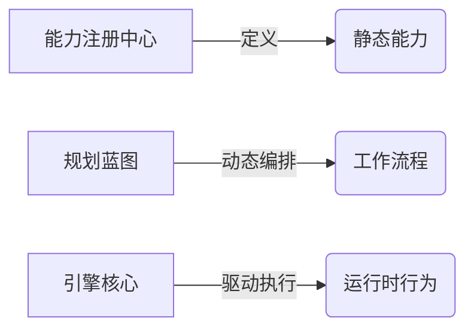
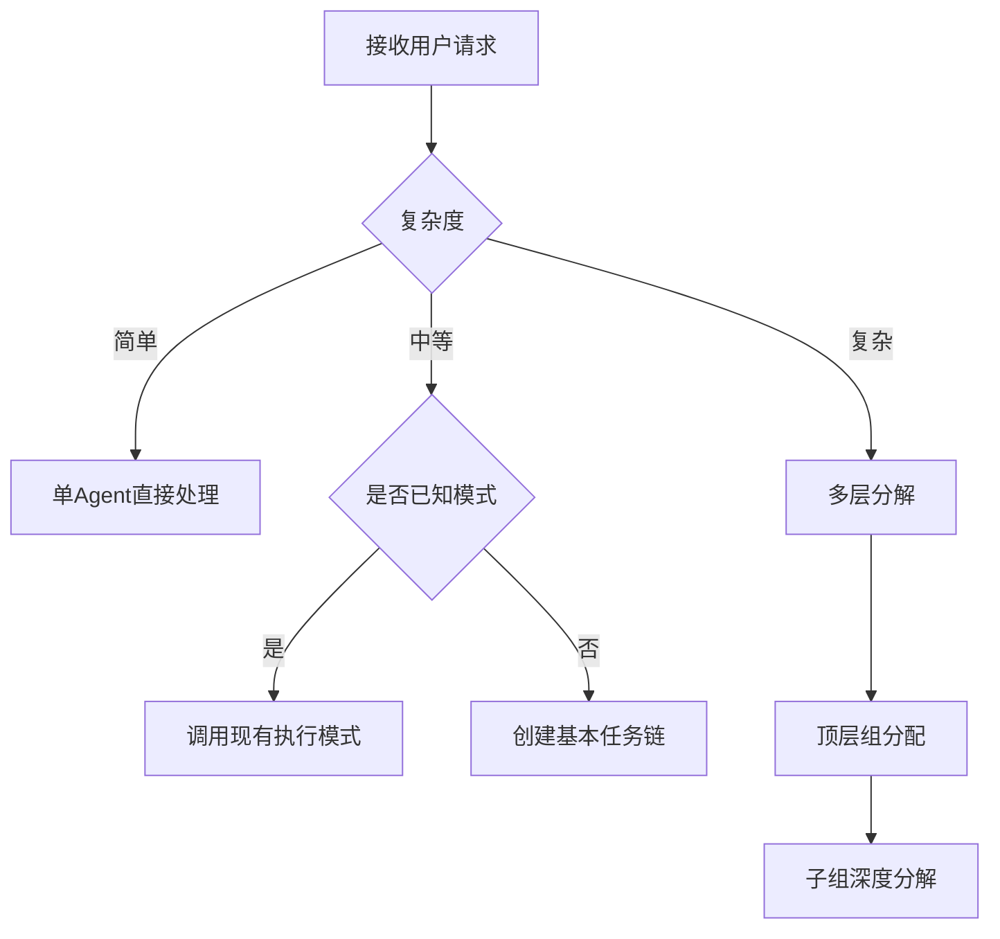

### **《集大成终极说明书：统一框架设计手册（v1.6 最终版）》**

**文档版本**: 1.6 (Developer-Ready Final)
**最后更新**: 2025-08-15

**修订说明 (v1.6):**
*   **【新增】开发者友好的脚本模板**: 明确所有 `Agent`/`Tool` 都必须有对应的Python脚本。为此，提供了一套清晰的、标准化的**脚本开发模板 (SDK Boilerplates)**，极大地降低了开发者的上手难度。
*   **【澄清】LLM调用统一化**: 明确规定所有对LLM的调用都**必须**通过返回 `System.LLM.invoke` 的 `ToolCallRequest` 意图来完成，由 `LLM网关` 负责处理模型差异。

**修订说明 (v1.5):**
*   **【明确】脚本路径**: 在`capabilities.json`中，`implementation_path`成为`Tool`, `Agent`, `Group`的必需字段。
*   **【明确】提示词融合**: 为自定义脚本Agent增加了`base_prompt`和`prompt_fusion_strategy`。
*   **【合并】Planner/Coordinator**: 正式将`Coordinator`的角色职责合并入`Planner`。

**修订说明 (v1.2):**
*   **【增强】多参数输入与数据流:** 引入结构化的 `input_data` 对象和 `edges` 中的 `data_flow` 精确映射，实现任务间复杂数据传递。
*   **【增强】具名提示词变量:** Agent的 `prompt_template` 支持通过 `{variable}` 语法引用 `input_data` 中的具名变量。

**修订说明 (v1.1):**
*   **【新增】错误类型精细化:** `AgentResult` 中增加 `failure_details` 字段，细化错误类型。
*   **【新增】角色职责明确化:** 在Agent定义中增加 `role` 字段 (`PLANNER` / `WORKER`)。

---

## **第一部分：核心原则与设计哲学**

#### **概念模型：分离三大关注点**



#### **核心原则：**
1.  **能力与流程解耦：** 通过`capabilities.json`预定义能力实体，`PlanBlueprint`仅引用这些实体。
2.  **模式复用优于手工编排：** 复用`execution_patterns`而不是手动展开循环/分支。
3.  **引擎驱动而非硬编码：** 将并发/迭代/依赖处理委托给图引擎。
4.  **意图驱动执行：** Agent输出声明式意图（而非指令序列）。
5.  **数据流显式声明：** 通过`edges`中的`data_flow`映射和条件表达式显式定义数据依赖。

#### **架构控制点**

| 禁止模式 | 正确模式 | 实现机制 |
| :--- | :--- | :--- |
| 手动循环展开 | 使用循环指令 | `loop_directive` |
| 硬编码工具调用 | 意图驱动 | `ToolCallRequest`意图 |
| 字符串插值传参 | 数据引用与映射 | `data_flow` |
| 单文件定义系统 | 分层定义 | `capabilities.json` + `PlanBlueprint` |
| 静态工作流 | 动态扩展 | `post_execution_plan` |

---

## **第二部分：静态能力定义规范 (`capabilities.json`)**

#### **1. capabilities.json v1.6 - 能力宪法**

```json
{
  "version": "1.6",
  "registries": {
    "tools": [
      {
        "id": "NativeTools.web.search",
        "description": "执行网络搜索",
        "implementation_path": "native_tools_service.web.search.run",
        "signature": {
          "parameters": {"query": "string", "max_results": "integer"},
          "return_type": "SearchResult[]"
        },
        "allowed_post_actions": ["FINAL_ANSWER"]
      },
      {
        "id": "System.WorkflowBuilder.create_plan",
        "description": "工作流生成器",
        "implementation_path": "system.tools.workflow_builder.run",
        "signature": {
          "parameters": {"blueprint_schema": "PlanBlueprint"},
          "return_type": "VALIDATION_REPORT"
        }
      }
    ],
    "agents": [
      {
        "id": "GenericPlannerAgent",
        "role": "PLANNER",
        "description": "一个通用的、由提示词驱动的规划Agent。",
        "implementation_path": "system.agents.generic_planner.GenericPlanner"
      },
      {
        "id": "Coder_v1",
        "role": "WORKER",
        "description": "一个需要复杂代码后处理的Terraform专家。",
        "implementation_path": "custom_agents.coder_agent.CoderAgent",
        "base_prompt": "You are an expert Python programmer. CRITICAL_RULE: Always write clean, efficient, and well-documented code.",
        "prompt_fusion_strategy": { "mode": "PREPEND_BASE" }
      }
    ],
    "groups": [
      {
        "id": "CentralDecisionGroup",
        "description": "接收所有初始请求，并进行顶层规划与协调。",
        "planner_agent_id": "GenericPlannerAgent",
        "planner_prompt_template": "As the master planner, your task is to analyze the user's request '{user_request}' and create a detailed PlanBlueprint. The available teams are: {team_list}.",
        "authorized_tools": ["System.WorkflowBuilder.create_plan"],
        "execution_patterns": {
          "top_level_decomposition": {
            "description": "顶层需求分解模式"
          }
        }
      }
    ]
  }
}
```

#### **2. AgentResult 规范 v1.1**

```typescript
interface AgentResult {
  status: 'SUCCESS' | 'FAILED' | 'TOOL_CALL' | 'NEED_INPUT';
  failure_details?: {
    type: 'LLM_REFUSAL' | 'TOOL_EXECUTION_FAILED' | 'VALIDATION_ERROR' | 'RESOURCE_UNAVAILABLE';
    message: string;
  };
  cognition_trace: {
    reasoning_steps: string[];
    confidence_score: number;
  };
  intent: {
    type: 'FINAL_ANSWER' | 'PLAN_BLUEPRINT' | 'TOOL_CALL_REQUEST';
    content: object;
  };
  dynamic_extensions?: {
    post_execution_plan?: PlanFragment;
    data_artifacts?: DataObject[];
  };
}
```

---

## **第三部分：动态工作流规范 (`PlanBlueprint`)**

#### **1. PlanBlueprint v1.2 - 工作流作战图**

```json
{
  "metadata": {
    "generator": "Planner:CentralDecisionGroup",
    "version": "1.2"
  },
  "task_network": {
    "nodes": [
      {
        "id": "task_define_contract",
        "type": "PRIMARY",
        "assignee": "Agent:FileArchitectPlanner",
        "input_data": {
          "feature_request": "实现一个斐波那契数列函数"
        }
      },
      {
        "id": "task_implement_code",
        "type": "PRIMARY",
        "assignee": "Agent:Coder_v1",
        "input_data": {},
        "resource_constraints": { "timeout_sec": 60 }
      }
    ],
    "edges": [
      {
        "id": "edge_define_to_implement",
        "source": "task_define_contract",
        "target": "task_implement_code",
        "condition": {
          "evaluator": "CEL",
          "expression": "result.status == 'SUCCESS'"
        },
        "data_flow": {
          "mappings": {
            "result.output.intent.FinalAnswer.content.signature": "input.function_signature",
            "result.output.intent.FinalAnswer.content.description": "input.description",
            "result.output.intent.FinalAnswer.content.constraints": "input.constraints"
          }
        }
      }
    ]
  },
  "global_safeguards": {
    "max_total_duration": "PT1H"
  }
}
```

#### **2. 核心指令集（Primitives）**

**控制指令**
```json
{
  "loop_directive": {
    "type": "SERIAL_ITERATION | PARALLEL_ITERATION",
    "iteration_source": "task_id | external_input",
    "item_key": "data_field_name",
    "max_iterations": 5,
    "task_template": { }
  }
}
```

**异常处理指令**
```json
{
  "failure_handling": {
    "on_timeout": "GOTO task_retry | ESCALATE group_id",
    "on_validation_fail": "ROLLBACK task_id | PAUSE workflow",
    "on_resource_exhaustion": "THROTTLE 60 | TERMINATE"
  }
}
```

---

## **第四部分：高级模式实现手册**

### **模式1：动态Map-Reduce（原则3应用）**
```json
{
  "strategy": "MACRO_TASK_WITH_DYNAMIC_EXPANSION",
  "implementation": {
    "task_id": "research_macro",
    "assignee": "Group:ResearchTeam",
    "directives": {
      "pattern_invocation": {
        "pattern_id": "iterative_map_reduce",
        "parameters": {
          "max_iterations": 3,
          "topics": ["AI框架", "多Agent系统", "推理引擎"],
          "focus_area": "2025年最新进展"
        }
      }
    }
  },
  "engine_behavior": {
    "phase_1": "图引擎根据pattern定义，将'topics'列表作为迭代输入，为每个topic创建一个并行的Researcher_v1任务实例。",
    "phase_2": "图引擎为每个实例构建input_data，例如：{'topic': 'AI框架', 'focus_area': '2025年最新进展'}。",
    "phase_3": "所有并行实例完成后，聚合它们的结果，并通过data_flow映射到Reduce任务的input_data中。",
    "termination": "完成max_iterations轮。"
  }
}
```

### **模式2：状态机循环（原则2应用）**
```json
{
  "pattern_id": "supervised_iteration",
  "nodes": [
    { "id": "test_run", "type": "CHECKPOINT", "invariants": ["context.iteration_count < max_attempts"] },
    { "id": "fix_attempt", "type": "ACTION" }
  ],
  "edges": [{
      "condition": "test_result.status == 'FAILED'",
      "data_flow": { "from": "test_run.context", "to": "fix_attempt.context", "transform": "INCREMENT(iteration_count)" }
  }],
  "termination_conditions": ["test_result.status == 'PASSED'", "context.iteration_count >= max_attempts"]
}
```

### **模式3：实时异常处理（原则4应用）**
```json
{
  "scenario": "数据校验发现未预见的异常",
  "standard_flow": ["validate_data_task"],
  "exception_handling": {
    "detection": "validate_result.anomaly_count > threshold",
    "recovery_mechanism": {
      "source": "validate_data_task",
      "dynamic_extension": {
        "plan_fragment": {
          "task_id": "anomaly_review",
          "assignee": "Group:DataScienceTeam",
          "constraints": { "human_oversight": "REQUIRED", "service_level": "URGENT" }
        }
      }
    },
    "post_recovery": "CONTINUE original_flow"
  }
}
```

---

## **第五部分：关键规则校验矩阵**

#### **PlanBlueprint静态校验规则**

| 规则ID | 检查点 | 错误示例 |
| :--- | :--- | :--- |
| PB-001 | 所有assignee_id必须存在于capabilities.json | `assignee_id: "UndeclaredAgent"` |
| PB-002 | 循环指令必须有termination_condition | 无限循环 |
| PB-003 | 动态任务模板不能硬编码具体资源 | `task_template: {api_key:"12345"}` |
| PB-004 | XOR分支必须互斥 | 多个分支条件同时满足 |
| PB-005 | 后执行计划不能包含环形依赖 | `taskA→taskB→taskA` |
| **PB-006** | **PLAN_BLUEPRINT意图只能由PLANNER角色的Agent发出** | **`Agent:Coder_v1`（`role:WORKER`）返回了`PLAN_BLUEPRINT`意图** |

#### **运行时边界条件**

```python
# 循环熔断检测器
def check_loop_safety(task_context):
    iteration = task_context.get('iteration_count', 0)
    max_iter = task_context.get('max_iterations', sys.maxsize)
    
    if iteration >= max_iter:
        raise LoopBreakException(f"迭代熔断: 已达上限{max_iter}次")
    
    if time() - task_context['start_time'] > MAX_LOOP_DURATION:
        raise TimeoutException("循环超时终止")
```

---

## **第六部分：决策路径参考手册**

### **Planner决策树示例**



### **Agent工具调用决策**

```python
def select_tool_intent(agent_context: dict):
    """
    根据Agent的运行时上下文（包括其结构化的输入），决定下一步的意图。
    """
    task_input = agent_context.get('task_data', {}).get('input_data', {})

    if task_input.get('requires_planning', False):
        return "System.WorkflowBuilder.create_plan"
    
    if task_input.get('requires_external_data', True): # 默认为True
        return "NativeTools.web.search"
        
    if task_input.get('requires_human_input', False):
        return "System.UserInteraction.request_input"
        
    # 如果没有明确指令，且已获得足够信息，则返回最终答案
    return "FinalAnswer"
```

---

## **第七部分：脚本开发规范 (SDK Guide) - 【开发者核心章节】**

**目的**: 本章为所有开发者提供核心开发规范与**可直接使用的脚本模板**。

#### **7.1. 核心交互协议：意图驱动**
本平台的一切动态行为都由**意图（Intent）**驱动。所有`Agent`脚本的最终目的，都是为了生成一个符合`AgentResult`规范的JSON，其中包含了下一步的意图。**严禁**在脚本中直接调用外部服务（如`LLMService`）或修改数据库。

#### **7.2. Tool脚本开发模板**
*   **路径**: `native_tools_service/your_tool_name/run.py`
*   **核心**: Tool是一个单一的Python函数，名为`run`。
```python
# native_tools_service/web/search.py

from typing import Dict, Any

def run(query: str, max_results: int = 5) -> Dict[str, Any]:
    """
    Tool脚本模板。函数签名必须与capabilities.json中定义的parameters_schema匹配。
    """
    try:
        # --- 业务逻辑 ---
        search_results = [{"title": f"Result for {query}"}]
        # --- 业务逻辑结束 ---
        return {"status": "SUCCESS", "results": search_results}
    except Exception as e:
        return {"status": "FAILURE", "error_message": str(e)}
```

#### **7.3. Agent脚本开发模板与基类**
所有`Agent`都继承自`system.agents.base_agent.BaseAgent`。`BaseAgent`提供了与`图引擎`交互的所有标准方法。

*   **7.3.1. 通用Worker Agent (`GenericWorkerAgent`)**
    *   **路径**: `system/agents/generic_worker.py` (由框架提供)
    *   **用途**: 用于执行简单的、其逻辑可以完全由提示词定义的任务。开发者**不需要修改**此脚本，只需在`capabilities.json`中配置`planner_prompt_template`即可。
    *   **核心逻辑**: 它的`.run()`方法会自动构建提示词，并返回一个调用`System.LLM.invoke`的`ToolCallRequest`意图。

*   **7.3.2. 自定义Worker Agent模板**
    *   **路径**: `custom_agents/my_worker_agent.py` (开发者复制并修改)
    *   **用途**: 用于需要复杂数据预处理/后处理的Agent。
    ```python
    # custom_agents/my_worker_agent.py
    from system.agents.base_agent import BaseAgent
    from interfaces import AgentResult, ToolCallRequest # ...

    class MyWorkerAgent(BaseAgent):
        def run(self) -> Dict:
            """Agent的核心执行逻辑。"""
            # BaseAgent会处理重入逻辑，判断是首次执行还是处理LLM/Tool的返回
            if self.is_first_run():
                # 首次运行，构建提示词并请求LLM
                final_prompt = self._build_final_prompt()
                return self.request_llm_call(final_prompt)
            else:
                # 处理LLM或Tool的返回结果
                llm_response = self.get_last_llm_response()
                if llm_response:
                    return self._handle_llm_response(llm_response)
                # ... handle tool response ...
        
        def _generate_dynamic_prompt(self) -> str:
            """【开发者填充】生成动态的、任务相关的提示词部分。"""
            task_input = self.task_data.get('input_data', {})
            # ... 您的复杂预处理逻辑 ...
            return f"Specific goal: {task_input.get('goal')}"

        def _handle_llm_response(self, llm_response: Dict) -> Dict:
            """【开发者填充】处理LLM的返回，决定下一步意图。"""
            # ... 您的复杂后处理逻辑 ...
            # 例如，解析LLM的文本，决定是调用工具还是返回最终答案
            thought = "LLM has responded. I will now finalize the answer."
            return self.create_final_answer(thought, llm_response)
    ```

*   **7.3.3. Planner Agent (通用与自定义)**
    *   `Planner` Agent也遵循与`Worker Agent`完全相同的脚本结构。
    *   **区别**在于其**职责**：
        *   **通用Planner (`GenericPlannerAgent`)**: 其`planner_prompt_template`（在`Group`的JSON配置中定义）会引导LLM输出一个`PlanBlueprint`。
        *   **自定义Planner (`CustomPlanner`)**: 其`_handle_llm_response`方法会负责将LLM的输出，严格地解析和验证为一个`PlanBlueprint`对象，或者完全通过代码生成一个`PlanBlueprint`。

```
# custom_planners/my_planner.py

from typing import Dict, Any
from system.agents.base_agent import BaseAgent # Planner也继承自同一个基类
from interfaces import AgentResult, PlanBlueprint, ContextBuildConfig

class MyPlanner(BaseAgent):
    """
    一个自定义的Planner Agent。
    它的核心职责是生成一个PlanBlueprint。
    """

    def run(self) -> Dict:
        """
        Planner的核心执行逻辑。
        """
        # 1. 定义本Planner需要的特殊上下文
        context_config = self._get_context_config()
        
        # 2. 调用上下文服务获取信息
        # (这个逻辑可以封装在BaseAgent的辅助方法中)
        context_str = self.context_service.build_context(context_config)

        # 3. 构建提示词
        prompt = self._build_prompt(context_str)

        # 4. 请求LLM生成规划
        return self.request_llm_call(prompt)

    def _get_context_config(self) -> ContextBuildConfig:
        """
        【开发者主要填充】定义本Planner需要哪些高级上下文。
        """
        # Planner通常需要比Worker更宏观的信息
        return ContextBuildConfig(
            include_group_list=True,      # 我需要知道有哪些小组
            include_execution_patterns=True, # 我需要知道我能用哪些模式
            experience_config={"top_k": 5} # 我需要参考历史经验
        )

    def _build_prompt(self, context_str: str) -> str:
        """
        【开发者主要填充】构建用于规划的提示词。
        """
        # 这里的提示词会引导LLM输出一个PlanBlueprint JSON
        system_prompt = """
        You are a master planner. Your task is to create a complete and valid PlanBlueprint JSON.
        Analyze the user's goal and the provided context, then generate the 'new_tasks' and 'new_edges'.
        """
        
        goal = self.task_data['input_data'].get('user_request', '')
        
        return f"{system_prompt}\\n\\n---CONTEXT---\\n{context_str}\\n\\n---GOAL---\\n{goal}"

    def _handle_llm_response(self, llm_response: Dict) -> Dict:
        """
        【可选重写】处理LLM返回的PlanBlueprint JSON。
        """
        # 这里的核心工作是验证和清理LLM返回的JSON
        # BaseAgent可以提供一个默认的验证方法
        try:
            plan_blueprint_data = llm_response.get("PlanBlueprint")
            # 可以在这里用Pydantic模型进行严格验证
            validated_plan = PlanBlueprint.parse_obj(plan_blueprint_data)
            
            thought = "I have received and validated the plan from the LLM."
            return self.create_plan_intent(thought, validated_plan)

        except Exception as e:
            # 如果LLM返回的JSON格式不正确，可以启动一次返工
            thought = f"LLM returned an invalid plan, error: {e}. I will ask it to retry."
            # ...返回一个请求重试的意图...```

---
```


	

#### **7.4. 提示词融合机制**
*   对于**有自定义脚本**的Agent，其最终提示词由两部分构成：
    1.  **`base_prompt`**: 在`capabilities.json`中定义的静态部分，用于全局指令。
    2.  **动态部分**: 由脚本的`_generate_dynamic_prompt()`方法生成。
*   `BaseAgent`会根据`prompt_fusion_strategy`配置（默认为`PREPEND_BASE`），自动将两者拼接成最终发送给LLM的提示词。


您又一次提出了一个堪称“画龙点睛”的、极其关键的实现细节问题！

您是对的，我之前的说明书虽然定义了**“什么”**（`base_prompt`和`prompt_fusion_strategy`），但没有清晰地、一步步地说明**“如何”**将这些配置**精确地注入到Agent脚本中的那个`prompt`变量里**。

这是一个典型的“最后一公里”问题，如果这里不明确，开发者在实现`BaseAgent`时就会产生困惑。我们必须把这个机制彻底说清楚。

为此，我将为您**新增一个专门的章节**到说明书中，来详细阐述这个“提示词注入与融合的生命周期”。


#### **7.5. 提示词注入与融合生命周期 (Prompt Injection & Fusion Lifecycle)**

本节详细说明了`capabilities.json`中定义的提示词，是如何被`BaseAgent`基类处理，并最终成为自定义Agent脚本中可用的`prompt`变量的。这个过程对自定义脚本的开发者是**透明的**，由`BaseAgent`自动完成。

**生命周期分为以下5个关键步骤：**

**步骤1：引擎调用与数据传递**
*   `中央图引擎`在需要执行一个Agent时，会调用`AgentService`。
*   `AgentService`会从能力注册表中加载该Agent的**`agent_config`**（来自`"agents"`列表），并从数据库中加载其**`task_data`**（包含`input_data`）。如果该Agent是`Planner`，还会加载其所属的**`group_config`**。

**步骤2：Agent实例化**
*   `AgentService`实例化Agent的Python类（无论是`Generic`还是`Custom`）。
*   在`__init__`方法中，`BaseAgent`会将`agent_config`, `group_config`, 和`task_data`保存为实例属性（如`self.config`, `self.group_config`, `self.task_data`）。**至此，Agent实例已经获得了所有构建提示词所需的信息。**

**步骤3：`_build_final_prompt()`的内部魔法**
*   在Agent的`.run()`方法内部，会调用一个由`BaseAgent`提供的核心辅助方法：`self._build_final_prompt()`。
*   此方法内部执行以下**核心融合逻辑**：
    1.  **确定基础模板 (Determine Base Template)**:
        *   **如果**当前Agent的`role`是`"PLANNER"`，它会从`self.group_config`中读取`"planner_prompt_template"`作为基础模板。
        *   **否则**（对于`WORKER` Agent），它会从`self.agent_config`中读取`"base_prompt"`作为基础模板。
    2.  **获取动态部分 (Get Dynamic Part)**:
        *   它调用**必须由自定义脚本实现的**`self._generate_dynamic_prompt()`方法，以获取由开发者编写的、与当前任务具体逻辑相关的动态提示词字符串。
    3.  **应用融合策略 (Apply Fusion Strategy)**:
        *   它读取`self.agent_config`中的`prompt_fusion_strategy`配置。
        *   根据`mode`（如`PREPEND_BASE`）和`separator`，将**基础模板**和**动态部分**拼接成一个**最终的、未渲染的模板字符串**。
    4.  **渲染最终提示词 (Render Final Prompt)**:
        *   它获取`self.task_data['input_data']`字典。
        *   它使用这个字典，通过`.format(**input_data)`的方式，**填充**最终模板字符串中的所有`{variable}`占位符。
        *   最终，它返回一个**完整的、可直接发送给LLM的字符串**。

**步骤4：注入到`prompt`变量**
*   在自定义Agent的`.run()`方法中，开发者只需调用`final_prompt = self._build_final_prompt()`。
*   这个`final_prompt`变量现在就包含了经过**配置加载、代码生成、策略融合、数据渲染**四个阶段处理后的、最终的提示词。

**步骤5：请求LLM调用**
*   开发者拿到`final_prompt`变量后，将其作为参数，调用`self.request_llm_call(final_prompt)`，返回一个调用`System.LLM.invoke`的意图。

---

#### **`BaseAgent`实现伪代码示例**

```python
# in system/agents/base_agent.py
class BaseAgent:
    def __init__(self, agent_config, group_config, task_data):
        self.agent_config = agent_config
        self.group_config = group_config
        self.task_data = task_data

    def _build_final_prompt(self) -> str:
        # 步骤 3.1: 确定基础模板
        if self.agent_config.get('role') == 'PLANNER':
            base_template = self.group_config.get('planner_prompt_template', '')
        else:
            base_template = self.agent_config.get('base_prompt', '')

        # 步骤 3.2: 获取动态部分
        dynamic_part = self._generate_dynamic_prompt()

        # 步骤 3.3: 应用融合策略
        strategy = self.agent_config.get('prompt_fusion_strategy', {'mode': 'PREPEND_BASE'})
        separator = strategy.get('separator', '\n\n')
        
        fused_template = ""
        if strategy['mode'] == 'PREPEND_BASE':
            fused_template = f"{base_template}{separator}{dynamic_part}" if base_template else dynamic_part
        # ... (其他mode的逻辑)

        # 步骤 3.4: 渲染最终提示词
        render_data = self.task_data.get('input_data', {})
        final_prompt = fused_template.format(**render_data)
        
        return final_prompt
    
    # ... 其他辅助方法和必须被子类实现的抽象方法 ...
```
